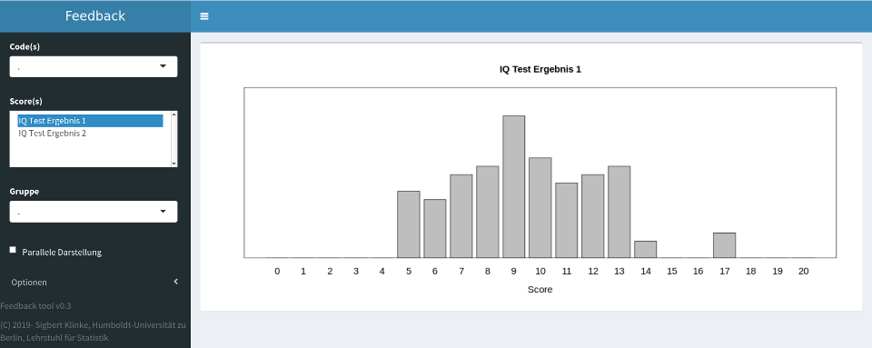
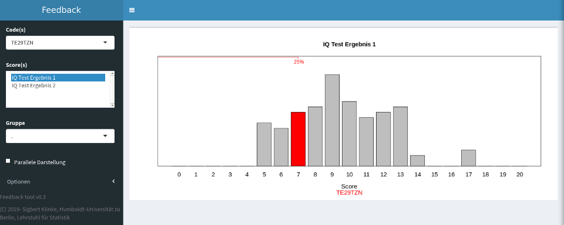
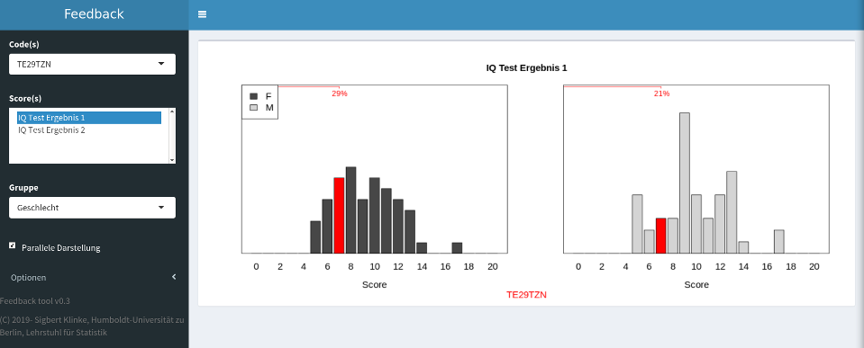
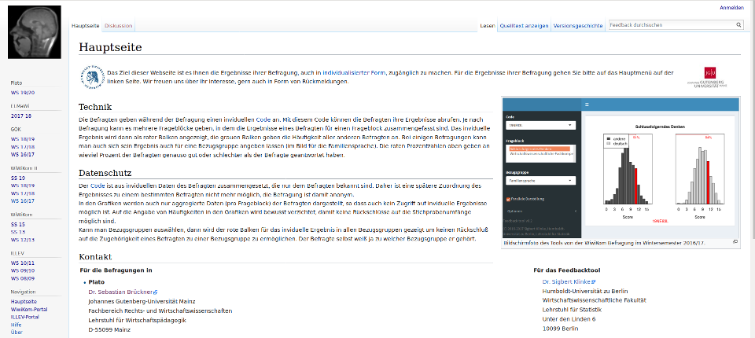

```{r, include = FALSE}
knitr::opts_chunk$set(
  collapse = TRUE,
  comment = "#>"
)
```

Since some years my colleagues and I conduct surveys to various topics. However, one problem, especially in panel studies, is to (re)capture enough respondents. This gave birth to the idea that respondents should get an individual feedback to their answers in the questionnaire and compare themselves to others.

My colleagues came up with an individual code which is composed by

* second and third letter of mothers' first name
* day in the birth month
* third and fourth letter of birth place
* first letter of respondents' name

|         |Mothers' first name|Day of birth  |Birth place|First name  |Code       |
|---------|-------------------|--------------|-----------|------------|-----------|
|Example 1|M**ar**ianne       |**12**.08.1989|Ha**mb**urg|**S**ven    |**ar12mbs**|
|Example 2|S**ar**ah          |**12**.03.1990|Ba**mb**erg|**S**tefan  |**ar12mbs**|

The code may not be unique as the examples show.

# Create a test data set for feedback

The package contains a function `generateTestData` which creates a test data frame, here with three additional
variables: `IQ1`, `IQ2` with a range approximately from 0-20 and `course` with a study course.

```{r}
library('feedback')
set.seed(0) # for creating always the same test data
x  <- generateTestData(n=100, 
                       IQ1=round(rnorm(100, 100, 15))%/%5-10,
                       IQ2=round(rnorm(100, 100, 15))%/%5-10,
                       course=sample(c("BWL", "VWL", "Statistik"), size=100, replace=TRUE)
                      )
# show all variable names in the data frame
names(x)
# show the first observation in the data frame
x[1,]   
```

# Create a feedback object

The next step is to create a `feedback` object. We use the three functions:

* `id` to identify the code variable
* `bar` to identify the variables which shown with a bar chart
* `grp` to identify the variables which are used for grouping

`bar` has optional parameters `min` (default: 0) and `max` (default: `NA`) which give the values the variable has, here `0`, `1`, ..., `20`.

```{r}
fb <- feedback(x, 'ID'=id('code'), 
              'IQ Test Ergebnis 1'=bar('IQ1', min=0, max=20),
              'IQ Test Ergebnis 2'=bar('IQ2', min=0, max=20),
              'Geschlecht'=grp('sex'),
              'Studiengang'=grp('course'))
summary(fb)
```

In the output you see `Less than 30 observations per group: VWL` which means that the subgroup `VWL` would 
have less 30 observations. Therefore it is deleted from the feedback object, the optional parameter `n` (default: 30) governs the exclusion of subgroups.

Note: the named parameters are used in the tool. The same holds for the variable values, e.g. for `sex` will be `F` and `M` used. 

# Run the Shiny app

The last step is to run the Shiny app with your data

```{r, eval=FALSE}
plot(fb)
```

This will 

1. save `fb` into `feedback.RDS` in your working directory,
2. copy the Shiny app `app.R` into in your working directory, and
3. start the Shiny app with your data.



After choosing a code (here `TE29TZN`, the first observation) we get the specific result for this respondent (the 25% gives the percentage of observations less or equal `7`)




# Run the Shiny app on a Shiny server

To run the app with your data on a shiny server, just copy `app.R` and `feedback.RDS` to the app directory on your server. 

If you have several feedback objects then rename `feedback.RDS` to `xyz.RDS` and use the URL `https://my.shiny.server:3838/myfeedbackappdir/?data=xyz`. 

# Privacy consideration

In the feedback object `fb` are only the information stored that are necessary for running the app:

1. The code and the value for a code for each variable. This is necessary because for a specific code we need to know the specific result to mark a specific variable value.
2. The conditional distribution for each group and subgroup. This is necessary to create the chart. However, absolute counts are not stored.
3. For a specific code and subgroups in each plot the bar is marked. The respondent will know to which subgroup he/she/it belongs.



If the RDS file is grabbed then the following information can be extracted:

* For a specific code a multivariate table of variables can be build.
* A minimal number of respondents can be determined. There may be respondents who do not agree to be in the feedback.
* Conditional frequencies for each subgroup, but not if a code belongs to a specific subgroup or the size of the subgroup.

# What can I do to improve privacy?

1. Think which variables you really want to include. More variables mean more detailled information about
a specific code.
2. Subgroups should have enough respondents. From the graphics a user may determine that a subgroup has only a few observations.

# Our feedback wiki

We are using this tool and its predecessor in a german wiki at Humboldt-Universität zu Berlin: https://mars.wiwi.hu-berlin.de/mediawiki/feedback.




